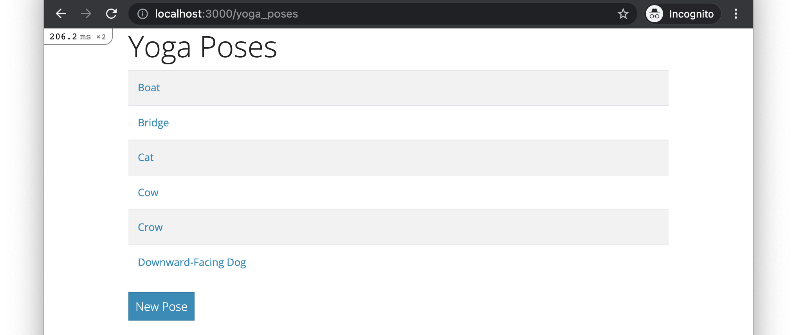
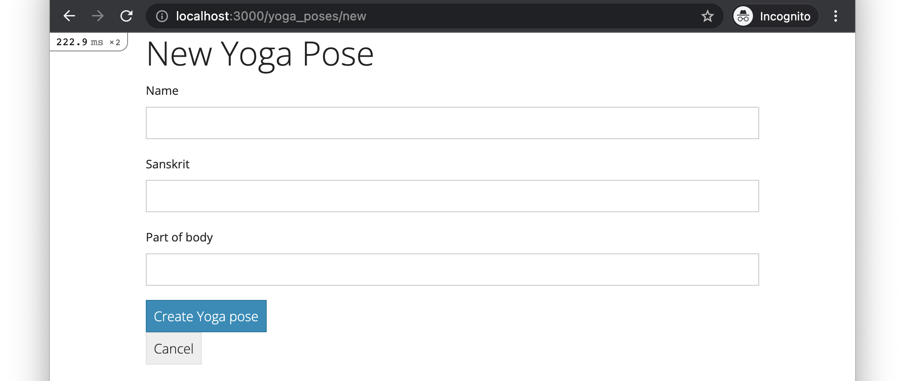
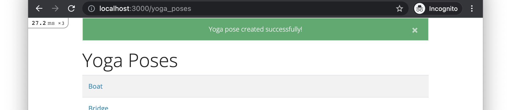
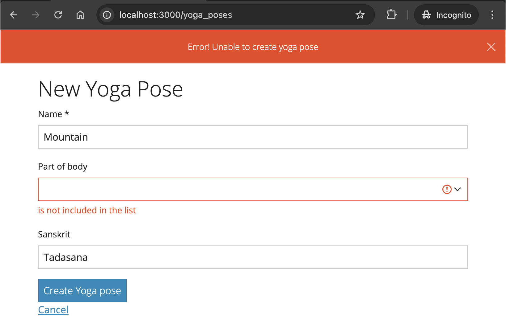

# Skills Test ST2

Time Limit: 30 minutes

## The Rules

- Closed neighbor.
- No texting/messaging/posting.
- Referring to the Demos-n-Deets and searching the web is OK.

## Starting the Test

1. **Setting Up Your Repository**:

   **Step 1: Access the GitHub Organization**
   - Log into GitHub and navigate to the organization **um-202480-comp-4081**, which I have created for the class. You can search for it in your GitHub account or use the direct link provided in the course materials.

   **Step 2: Create a New Repository from the Template**
   - Once you are in the organization, click on the **“New repository”** button at the top-right of the page.
   - On the next page:
     - **Owner**: Ensure that the owner is set to **um-202480-comp-4081**.
     - **Repository template**: From the list of available templates, select the **`st1-starter`** template. This will create the repository with the starter code for this assignment.
     - **Repository name**: Name your repository using the following format: `st1-<um-username>`. Replace `<um-username>` with your actual University of Memphis username (e.g., `st1-jdoe`).
     - **Repository privacy**: Set the repository to **Private**, so that only you and your instructors can access it.
   - After filling out these details, click **Create repository**.

   **Step 3: Clone the Repository and Set Up Your Local Environment**
   - After creating the repository, you need to clone it to your local machine and set it up following steps similar to the Running Apps demo. Then you will be ready to start the task.

## About the Base App

Initially, the base app contains the following:

- A `YogaPose` model class with seeds script.
- A `YogaPosesController` controller class.
- The routes, controller actions, and view templates for index and show pages.
- A root route that redirects to the index page.
- The necessary infrastructure for displaying flash notifications.

If you run the base app and open <http://localhost:3000> in your browser, the following page should be displayed (note that the "New Pose" link is broken initially):



## Tasks to Perform

In completing all of the following tasks, build things in the ways described in the Demos-n-Deets and use all the standard naming conventions. As always, the CSS styling of things is a low priority, so don't get hung up on making yours match exactly.

1. **New/Create Form Page.** Create an new/create form page that looks like this (the "Cancel" link should link to the index page):

    

    If the form submission is successful, the app should be redirected to the index page and a flash success message should be displayed, like this:

    

    If the form submission fails, the app should re-render the form with error messages, like this:

    

    You can test the error messages by entering an invalid part_of_body value. See the model class for the details of the inclusion validation.

2. **Hyperlink.** Fix "New Pose" link on the index page so that it links to the new-form page.

### Detailed Specifications

#### Existing Functionalities

- **Feature: Browse YogaPoses**
  - As a user,  
    I want to see a list of yoga_poses  
    So that I can choose one to view more details about
  - **Scenario**: Viewing the yoga_pose index page content
    - Given I have created two sample YogaPose records  
    - And I am on the /yoga_poses page  
    - Then I should see an `h1` element with text "Yoga Poses"  
    - And I should see two table body rows with links with the sample records' names  
    - And I should see a link with text "New Pose"
  - **Scenario**: Redirecting from the root page to the yoga_poses page
    - When I visit the root URL  
    - Then I should be automatically redirected to the /yoga_poses page
- **Feature: View YogaPose Details**
  - As a user,  
    I want to see detailed information about a selected yoga_pose  
    So that I can learn more about it
  - **Scenario**: Viewing a yoga_pose show page content
    - Given I have created a sample YogaPose record  
    - And I am on its /yoga_poses/:id page  
    - Then I should see an `h1` element with the yoga_pose's name in the format like "#[name] Pose"  
    - And I should see an `p` element with the italic text containing the pose's sanskrit name  
    - And I should see an `p` item with the text in the format "Part of Body: [part]"  
    - And I should see a link with text "Back"
  - **Scenario**: Navigating to a yoga_pose show page from the index page
    - Given I am on the /yoga_poses page  
    - When I click on a yoga_pose's name link  
    - Then I should be on the /yoga_poses/:id page for the selected yoga_pose
  - **Scenario**: Navigating back to the yoga_pose index page from the show page
    - Given I am on the /yoga_poses/:id page  
    - When I click on the "Back" link  
    - Then I should be on the /yoga_poses page

#### New Functionalities

- **Feature: Create New YogaPose**
  - As a user,  
    I want to add a new yoga_pose to the playlist  
    So that I can expand my list of yoga_poses
  - **Scenario**: Viewing the new yoga_pose form page
    - Given I am on the /yoga_poses/new page  
    - Then I should see an `h1` element with text "New Yoga Pose"  
    - And I should see a form with fields "Name", "Part of body", "Sanskrit", and a "Create Yoga pose" button
    - And I should see a link with text "Cancel"
  - **Scenario**: Creating a new yoga_pose with valid details
    - Given I am on the /yoga_poses/new page  
    - When I fill in an name
    - And I select a part of body from the list
    - And I fill in a sanskrit name  
    - And I click the "Create Yoga pose" button  
    - Then a YogaPose record with matching attribute values should be created  
    - And I should be on the /yoga_poses page  
    - And I should see a success-styled flash message with text "Yoga pose created successfully!"  
    - And I should see the new yoga_pose in the yoga_pose list
  - **Scenario**: Creating a new yoga_pose with missing name
    - Given I am on the /yoga_poses/new page  
    - When I do not fill in a title  
    - And I click the "Create Yoga pose" button  
    - Then a YogaPose should not be created  
    - And I should see a HTML5 validation popup with text "Please fill out this field."
  - **Scenario**: Creating a new yoga_pose with missing part of body
    - Given I am on the /yoga_poses/new page  
    - When I do not change the default part of body from ""
    - And I click the "Create Yoga pose" button  
    - Then a YogaPose should not be created  
    - And I should see an error-styled flash message with text "Error! Unable to create yoga pose"  
    - And I should see the new yoga_pose form with error messages indicating the validation failures
  - **Scenario**: Navigating to the new yoga_pose page from the index page
    - Given I am on the /yoga_poses page  
    - When I click on the "New Pose" link  
    - Then I should be on the /yoga_poses/new page
  - **Scenario**: Navigating back to the yoga_pose index page from the new page
    - Given I am on the /yoga_poses/new page  
    - When I click on the "Cancel" link  
    - Then I should be on the /yoga_poses page

Additional Constraints:

- You must follow the standard Rails conventions:
  - Each page must have a path helper following the standard Rails convention:
    - `/yoga_poses` is `yoga_poses_path`
    - `/yoga_poses/:id` is `yoga_pose_path`
    - `/yoga_poses/new` is `new_yoga_pose_path`
  - `get /yoga_poses` routes to `YogaPosesController#index`
  - `post /yoga_poses` routes to `YogaPosesController#create`
  - `get /yoga_poses/:id` routes to `YogaPosesController#show`
  - `get /yoga_poses/new` routes to `YogaPosesController#new`
- Links must use the `link_to` helper with the appropriate path helper
- All HTML tags must be properly closed
- No duplication of `head`/`style`/`body` elements in the rendered HTML

## How to Submit

Once you’ve completed the task and confirmed that all tests pass:

1. **Commit your changes**:
   - Add all your changes:

     ```bash
     git add -A
     ```

   - Commit your work with a meaningful message:

     ```bash
     git commit -m "Completed ST2 Task"
     ```

2. **Push your changes to GitHub**:
   - Push your commits to the remote repository:

     ```bash
     git push
     ```

3. **Generate ZIP Archive**:
   - Generate a ZIP archive of your project by running the following command:

     ```bash
     git archive -o ../st2-submission.zip --prefix=st2-submission/ HEAD
     ```

    This command should result in a file `st2-submission.zip` being created in your `workspace` folder. Do not change anything about the command.

4. **Submit to Canvas**:
   - In Canvas, submit:
     - The ZIP file of your repo.
   - **Important!** You do not need to submit anything related to your repo to Canvas. The repo must be owned by the 4081 organization and named as instructed to be graded.
